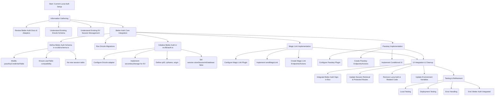

# Better-Auth Migration Plan

This document outlines the detailed plan to replace Lucia Auth with Better-Auth for magic link and passkey authentication, leveraging the existing Cloudflare D1 and KV setup.

## Overall Goal

Replace Lucia Auth with Better-Auth for magic link and passkey authentication, leveraging existing Cloudflare D1 and KV setup.

## High-Level Flow

## Detailed Steps

### Phase 1: Information Gathering and Schema Understanding (Completed)

- Reviewed Better-Auth Documentation for Cloudflare D1 and Adapters.
- Understood Existing Drizzle Schema (`src/db/schema.ts`).
- Understood Existing KV Session Management (`src/utils/kv-session.ts`).

### Phase 2: Better-Auth Core Integration

1.  **Define Better-Auth Schema in `src/db/schema.ts`:**
    - Modify `passKeyCredentialTable` to align with Better-Auth's requirements:
      - Rename `credentialPublicKey` to `publicKey`.
      - Add `name: text()`, `deviceType: text()`, `backedUp: integer().as('boolean')` columns.
      - Keep existing `userAgent`, `ipAddress`, `updatedAt`, `updateCounter` columns.
    - Ensure `userTable` is compatible.
    - Do NOT add a new `session` table to `src/db/schema.ts` as we will use `secondaryStorage` for KV.
2.  **Run Drizzle Migrations:** Generate and apply new Drizzle migrations to update the D1 database schema based on the `passKeyCredentialTable` changes.
3.  **Initialize Better-Auth in `src/lib/auth.ts` (new file):**
    - Import `betterAuth` and `drizzleAdapter`.
    - Configure the Drizzle adapter with the `DB` binding from Cloudflare Workers and `provider: "sqlite"`.
    - Implement `secondaryStorage` to use the existing Cloudflare KV (`KV_BINDING`) via `src/utils/kv-session.ts`. This will involve creating an object with `get`, `set`, and `delete` methods that wrap the `kv.get`, `kv.put`, and `kv.delete` functions from `src/utils/kv-session.ts`.
    - Define `rpID`, `rpName`, `origin` for passkey configuration.
    - Set `session.storeSessionInDatabase: false` to ensure sessions are primarily stored in KV.

### Phase 3: Magic Link Implementation

1.  **Configure Magic Link Plugin:** Add the magic link plugin to the Better-Auth initialization in `src/lib/auth.ts`.
2.  **Implement `sendMagicLink`:** Create a function that uses the existing email service (likely `src/react-email`) to send the magic link URL generated by Better-Auth. This function will be passed to the magic link plugin configuration.
3.  **Create Magic Link Endpoints/Actions:**
    - A server action or API route to initiate the magic link flow (call `auth.signIn.magicLink`).
    - A server action or API route to verify the magic link (call `auth.verify.magicLink`).
    - Update `src/app/(auth)/sign-in/page.tsx` to use the magic link initiation.

### Phase 4: Passkey Implementation

1.  **Configure Passkey Plugin:** Add the passkey plugin to the Better-Auth initialization in `src/lib/auth.ts`, including `rpID`, `rpName`, `origin`.
2.  **Create Passkey Endpoints/Actions:**
    - Server actions or API routes for passkey registration (`auth.passkey.addPasskey`).
    - Server actions or API routes for passkey authentication (`auth.passkey.signIn`).
    - Update `src/app/(auth)/sign-up/page.tsx` and `src/app/(settings)/settings/security/page.tsx` to use these actions.
3.  **Implement Conditional UI:** Add `autocomplete="webauthn"` to relevant input fields and preload passkeys as per documentation.

### Phase 5: UI Integration and Cleanup

1.  **Integrate Better-Auth Sign-in Box:** Replace existing forms in `src/app/(auth)/sign-in/page.tsx` and `src/app/(auth)/sign-up/page.tsx` with the Better-Auth sign-in box. This will require understanding how to pass the configured Better-Auth instance to the client-side components.
2.  **Update Session Retrieval and Protected Routes:**
    - Modify `getSessionFromCookie` and related functions in `src/utils/auth.ts` (or a new utility file) to use `auth.api.getSession` from Better-Auth, ensuring it fetches from the `secondaryStorage` (KV).
    - Adapt `requireVerifiedEmail` and `requireAdmin` to work with the new Better-Auth session structure.
3.  **Remove Lucia Auth and Related Code:** Delete `src/utils/auth.ts` (after extracting necessary non-auth logic like `getUserFromDB`, `getUserTeamsWithPermissions`, `canSignUp`, `addFreeMonthlyCreditsIfNeeded` into new utility files) and any other files or dependencies related to Lucia Auth.
4.  **Update Environment Variables:** Add any new environment variables required by Better-Auth to `.dev.vars` and `wrangler.jsonc`.

### Phase 6: Testing and Refinement

1.  **Local Testing:** Thoroughly test magic link and passkey authentication flows locally.
2.  **Deployment Testing:** Deploy to a staging environment and test all authentication flows.
3.  **Error Handling:** Ensure robust error handling for all authentication-related operations.
